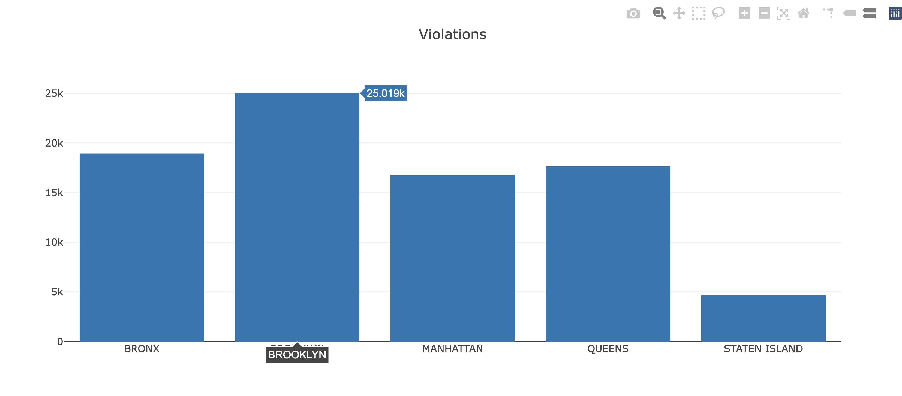
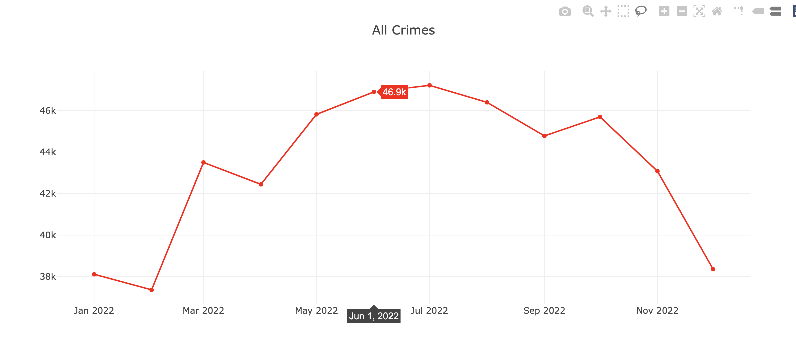
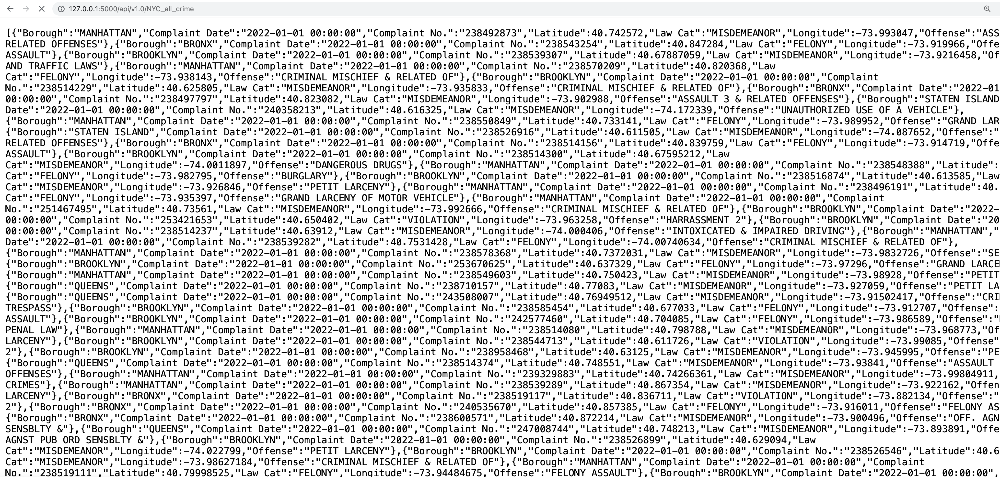

# NYC-Crime-Dashboard
 

A project that uses Python (Pandas, Flask , SQLite3), JavaScript, HTML, CSS, Bootstrap, Leaflet, Plotly to build an interactive dashboard for visualizing a dataset of over half a million crimes that occurred in New York City in 2022. The dataset was sourced through https://opendata.cityofnewyork.us/
 

   
 
 

## Table of Contents
### Introduction
### Features
### Requirements & Dependencies
### Project Structure
### Usage
### Contributing
### License
 

### Introduction
This JavaScript project fetches JSON crime data from flask powered URLs to create an interactive dashboard on a webpage. The dashboard allows users to select a NYC borough from a dropdown menu in a Bootstrap navbar to initiate interactivity on a leaflet map and get the crime summary for the selected borough. When a borough is selected from the dropdown, the map zooms to the location, a marker pops up with a `CLICK HERE` message, and when the marker is clicked, the crime summary for the borough is displayed. 

Users may also select a law category such as `Felonies` or `Violations` from a button-group in the navbar and the webpage will scroll to the interactive Plotly bar graph that visualizes the selection. The `All Crimes` button in the button-group displays the interactive Plotly line graph for all crimes in NYC for the selected year. 

Additionally, users may click the `Raw Data` button in the navbar to view the raw data as a JSON file in a new tab. See images below:
 

##### A borough is selected from the dropdown menu and the map zooms to the location
   
 
 
 
 

---

##### The marker is clicked and the crime summary for the borough is displayed  
   
 
 
 
 

---

##### The "Violations" button is clicked and the page scrolls to the Plotly bar graph
 
 
 
 
 

---

##### The "All Crimes" button is clicked and the page scrolls to the Plotly line graph  
    
 
 
 
 

---

##### The "Raw Data" button is clicked and the raw data is displayed in a new tab
   
 
 
 
 

---
 

### Features
- Use Python and Pandas to clean and format a CSV dataset to load a database. 

- Use Sqlite3 to create and load a database from a Pandas dataframe.    

- Use Flask to build API endpoints to serve the data from the database to the webpage.  

- Use HTML, CSS, Bootstrap, JavaScript, Leaflet, and Plotly to build an interactive dashboard for visualizing the data. 

 

### Requirements & Dependencies
All the necessary JavaScript libraries, including Bootstrap, Leaflet and Plotly.js, are included directly in the accompanying HTML file using `<script>` tags. These libraries are either hosted via Content Delivery Networks (CDNs) or included locally. You will also need to install the following dependencies:   

Python (version 3.10.9)
Pandas (version: 2.0.3)
Flask (version: 2.2.2)
SQLite3 (version: 3.41.2)

 

### Project Structure
 

#### ETL

The ETL process for this project is performed in a Jupyter Notebook (`etl.ipynb`) using Python, Pandas, and SQLite3. The notebook contains the following steps:   

1. **Set Up Dependencies:** Import the necessary Python software.

2. **Read the CSV File:** Read the CSV file into a Pandas DataFrame using `pd.read_csv`. The dataset is downloaded from the source and contains over half a million rows.   

3. **Clean the Data:** The dataset is cleaned and formatted using Pandas. The following steps are included:
   - Drop unnecessary columns
   - Drop rows with missing/invalid values  
   - Rename columns
   - Convert data types

4. **Create the Database:** The `NYC_Crime.db` database is created using `sqlite3.connect`, and the cleaned DataFrame is loaded into the database under the `NYC_crimes` table using `df.to_sql`. 
 
 

#### Flask API  
The Flask API is created in a Python file (`app.py`). Here are the key steps in the API creation process:   

1. **Set Up Dependencies:** Import SQLIte3, Flask, jsonify, render_template. 

2. **Create the Flask App:** Create a Flask app instance using `Flask(__name__)`.   

3. **Define the Home Route:** Use `render_template` to ensure that the home route renders the `index.html` template. This is important to run the dashboard on the local server. You will need to ensure that the `index.html` file is in the `templates` folder, and you will have to restructure the project folder and necessary scripts if you wish to deploy the dashboard on a web server.   

4. **Define all the other necessary Routes:** Build the routes needed for the dashboard: borough summary, category summary, and the raw data.  

 

#### HTML Setup
The HTML file (`index.html`) in this project is structured as follows:

1. **Document Type Declaration:** `<!DOCTYPE html>` defines the document type and version of HTML being used.    

2. **Head Section** `<head>` contains meta information about the document, such as character encoding, viewport settings, and the page title.   

3. **Bootstrap Styling** `<link rel="stylesheet">` is a popular CSS framework that is linked in the `<head>` section to provide styling for the webpage, including the navbar, buttons, and the dropdown menu.  

4. **Body Section** `<body>` contains the main content of the webpage, including the dashboard elements.    

5. **Dashboard Structure:** The interactive dashboard is structured within the `<body>`, as follows:
   - **Navbar:** A Bootstrap navbar at the top of the page containing the project title, dropdown menu for selecting a borough, and a button group for selecting crime categories and all crime summary to scroll to the respective graphs. The `Raw Data` button is also included in the navbar in a separate div to separate it from the other buttons. 
   - **Map Section:** A section for displaying the leaflet map.     
   - **Button Group:** A button group for selecting the crime category.    
   - **Chart Sections:** Two sections for displaying charts and graphs:
     - Bar Chart
     - Line Chart

6. **JavaScript File:** JavaScript file `logic.js` is included at the end of the `<body>` to handle interactivity and data visualization. The other necessary libraries are tagged in the `<head>` section to ensure that they are loaded first to avoid issues with the JavaScript code and the performance of the dashboard.

 

#### JavaScript Setup
The `logic.js` file is used to create and update the interactive charts and graphs on the NYC Crime Dashboard. Here's an overview of its key functionalities: 

1. **Ensure DOM is Loaded Before all Webpage Executions:** An event listener is used to ensure that the DOM is loaded before all webpage executions. This is important to ensure that the webpage is fully loaded before the JavaScript code is executed.   

2. **Initialize the Leaflet Map:** The `L.map` function is used to initialize the leaflet map and set the view to the center of NYC. The `L.tileLayer` function is used to add the map tile layer to the map.   

3. **Create a Layer Group for Markers:** A layer group is created for the markers. This is important to ensure that the markers are cleared when a new borough is selected from the dropdown menu.  

4. **Create a Function to Fetch the Crime Summary Data and Show on Marker Click:** The `fetch` function is used to fetch the crime summary data from the Flask API endpoint. The data is then used to create a popup message for the marker. 

5. **Handle Changes in the Dropdown Selection:** The `querySelector` function is used to handle changes in the dropdown selection. When a new borough is selected, the map zooms to the location and a marker pops up. 

6. **Hard-code the Geocoordinates for Boroughs:** The geocoordinates for each borough are hard-coded in a dictionary. This is important to ensure that the map zooms to the correct location when a borough is selected from the dropdown menu. 

7. **Create Functions for the Plotly Bar/Line Charts:** The `createBarChart` function is used to create the Plotly bar/line charts. 

8. **Fetch the Data for the Plotly Bar/Line Charts:** The `fetch` function is used to fetch the data for the Plotly bar/line charts from the Flask API endpoints. 

 

### Usage
1. Ensure that you have all the necessary dependencies and files/links/scripts. 
2. Load the project files in an appropriate code editor such as Jupyter Notebook. 
3. Open the terminal at the folder containing the `app.py` file, ensure any virtual environments are activated, and run  appropriate command such as `flask run` to start the Flask server.
4. Follow the `http` link in the terminal to open the dashboard in a browser. 

#### Contributions
Contributions to this project are highly encouraged! If you wish to contribute, please follow these guidelines:

- Fork the NYC-Crime-Dashboard repository and clone it locally.
- Create a new branch for your feature or bug fix.
- Commit your changes with descriptive commit messages.
- Push your branch to your forked repository.
- Submit a pull request to the original repository.
- Please ensure that your code adheres to the project's coding style and conventions.

If you encounter any issues or have suggestions for improvements, please open an issue on the GitHub repository.

### License
These projects are licensed under the MIT License. Feel free to use, modify, and distribute the code as per the terms of the license. 